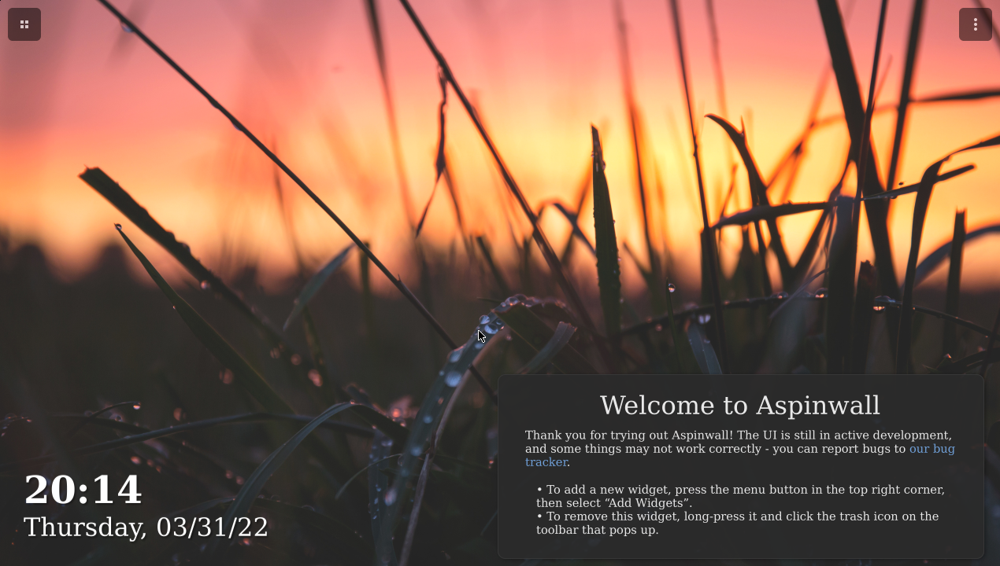

# Aspinwall

Linux tablet shell that turns your device into a smart hub when not in use

## About

Aspinwall is a Linux interface for tablets and touchscreen devices. It offers:

- A clean, focused launcher with a widget view - reminiscent of smart hub devices
- Some level of convergence - the shell works on both vertical (portrait) and horizontal (landscape) displays
- A widget API for creating your own widgets
- (TODO) Multitasking features, such as a dedicated app list and easy window control
- (TODO) Integration with voice assistants (see our Mycroft GUI, [Lapel](https://github.com/aspinwall-ui/lapel))

## Installing

Currently, the project isn't available in any repositories; each component has to be compiled manually. The README files in each component's repository explain the process.

The two main components of the shell are:

- [Aspinwall Launcher](https://github.com/aspinwall-ui/aspinwall-launcher)
- [Aspinwall Shell](https://github.com/aspinwall-ui/aspinwall-shell)

We're planning to add guides for running Aspinwall as soon as it's easily possible.

## Contributing

We accept contributions! See [Contributing to Aspinwall](CONTRIBUTING.md).

If you don't know how to code, don't worry - you can also help out with documentation or translations. Aspinwall's development relies on contributions from volunteers - any help is appreciated!

## FAQ

### **Q:** Where does the name come from?

**A**: The name *Aspinwall* is a reference to the location of [Henryk Sienkiewicz](https://en.wikipedia.org/wiki/Henryk_Sienkiewicz)'s novel, *The Lighthouse Keeper*. There's no real reason for why it was picked; it was chosen primarily for aesthetic purposes.

### **Q:** Does Aspinwall run on Android?

**A:** No. Aspinwall is a Linux shell, and there are no plans to release an Android port of any of the shell's elements, unless a GTK4 Android port arises at some point.

With that being said, we encourage using Aspinwall on any old Android tablets you may have; give [postmarketOS](https://postmarketos.org) a try. Aspinwall is being developed with the limitations of downstream kernels in mind, so it should work relatively well on older devices not running a (close to) mainline kernel.

*Developer's note: Aspinwall is planned to be packaged for postmarketOS, however it is not currently available as the project is still in very early development. Also, we are in no way affiliated with postmarketOS.*

### **Q:** Does Aspinwall run on Windows/Mac/any other platform supported by GTK4?

**A:** Aspinwall uses a handful of Linux-specific APIs and packages for some of its features (NetworkManager for WiFi control, etc.), and it's not meant to be run on anything other than Linux. While the launcher may work, some widgets may not. The shell will also completely lack functionality.

### **Q:** Is Aspinwall a GNOME project?

**A:** Aspinwall attempts to follow some design philosophies from Phosh and GNOME, but is not affiliated with either of the two.
